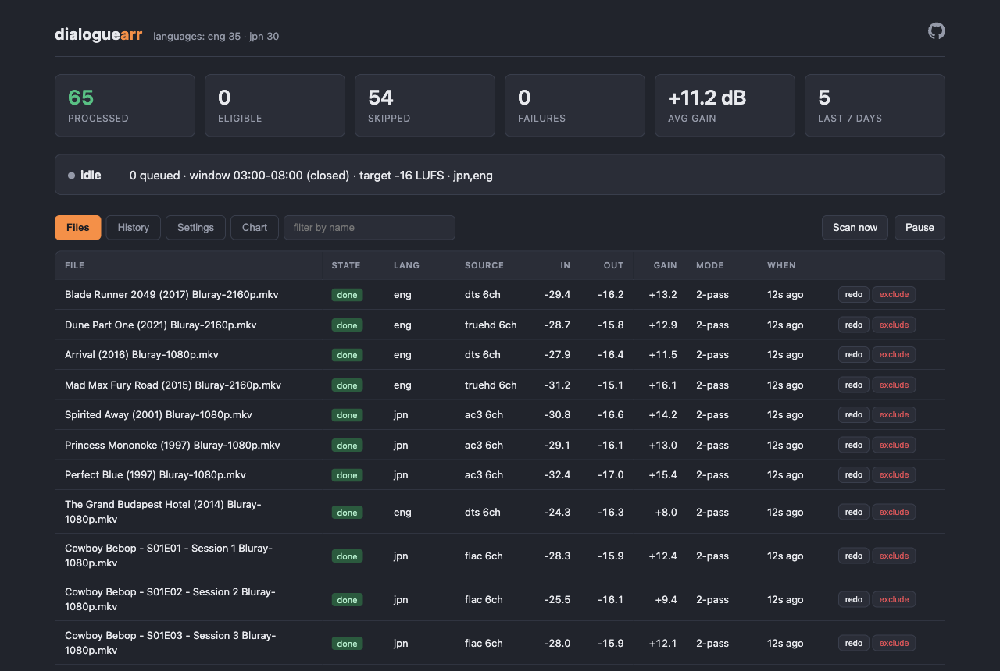
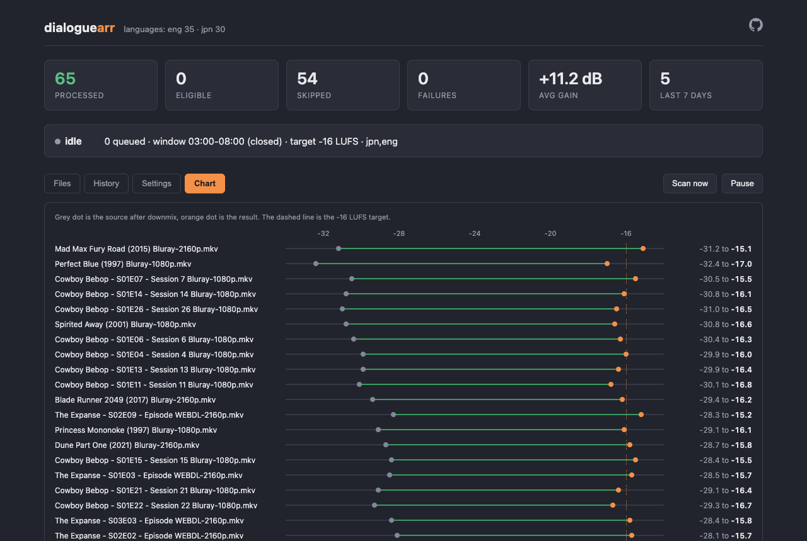
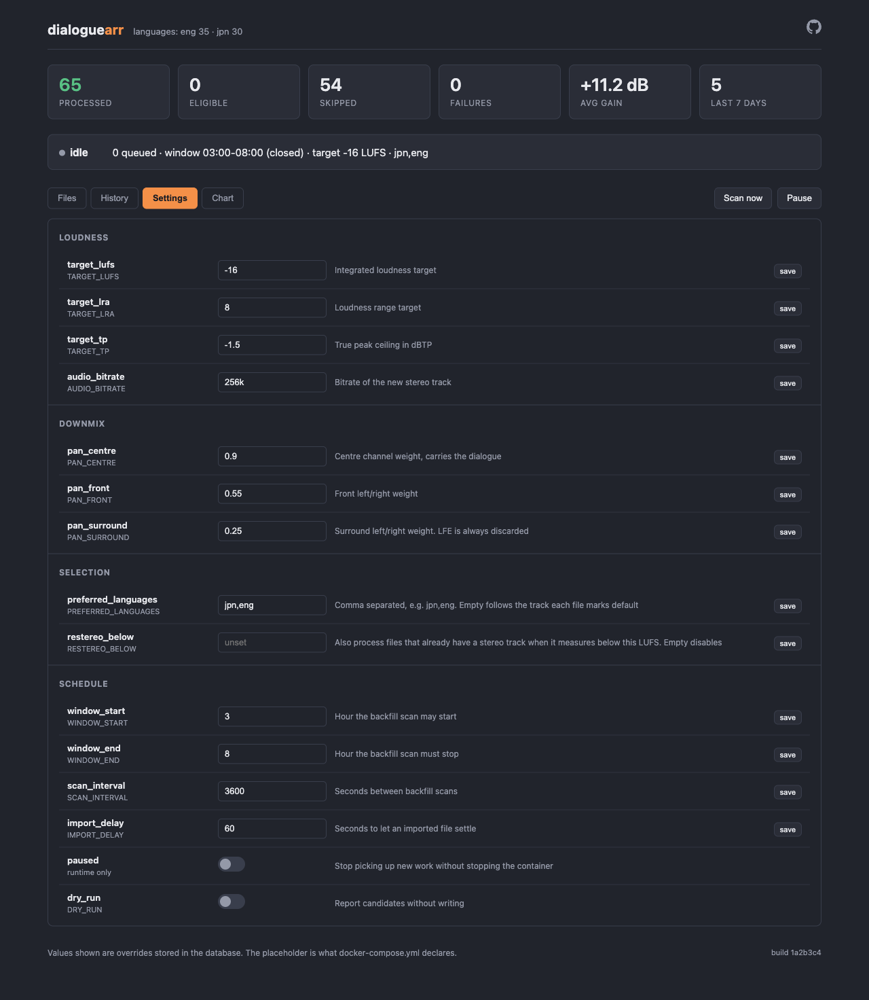

<h1 align="center">dialoguearr</h1>

<p align="center">
  <b>Turn the volume down, not up.</b><br>
  Adds a dialogue-forward stereo track to media that only carries surround audio,
  so speech stays audible on TV speakers without the action scenes becoming deafening.
</p>

<p align="center">
  <a href="https://github.com/thomvandevin/dialoguearr/actions/workflows/build.yml"></a>
  <a href="https://github.com/thomvandevin/dialoguearr/pkgs/container/dialoguearr"></a>
  
  <a href="LICENSE"></a>
</p>

<p align="center">
  
</p>

## The problem

Films are frequently mastered far below streaming loudness while peaking near full scale.
Measured across one film:

```
input_i   : -27.60 LUFS   average level, ~12 dB below streaming norm
input_tp  :  -1.84 dBTP   peaks essentially at full scale
```

A 26 dB spread. Dialogue sits at -27.6 so you turn the volume up, then the next explosion
hits full scale.

A television folding 5.1 into two speakers makes it worse: the centre channel carrying the
dialogue is mixed in with the LFE and surround channels at roughly equal weight, so speech
competes with effects instead of sitting above them.

**Media servers usually cannot help.** Plex hands the untouched bitstream straight to the TV
(`decision=direct play`), so any dialogue-boost setting in the client is silently discarded,
and client profile limits do not reliably force a server-side downmix. The only durable fix
is to change what the file contains.

## What it does

For each file holding a 6-channel track but no stereo track, it adds an AAC 2.0 track:

- **Centre-forward downmix with LFE discarded.** The LFE channel is exactly what makes action
  scenes boom and contributes nothing to speech.
  ```
  FL = 0.9*FC + 0.55*FL + 0.25*SL
  FR = 0.9*FC + 0.55*FR + 0.25*SR
  ```
- **Two-pass `loudnorm`** to a target loudness with a constrained loudness range.
- Marked as the default track, with **the original surround track always preserved**.

The new track's title doubles as the marker that the file is done, so runs are idempotent.

Cost is about **32 KB/s of runtime**, so roughly 220 MB added to a two-hour film.

## Features

- **Hooks into Sonarr and Radarr** via a webhook, so new imports are handled within minutes
- **Nightly backfill** for an existing library, confined to a window so it never competes with playback
- **Picks the right language** when a release carries several dubs
- **Web UI** with coverage, per-file levels, run history and live status
- **Runtime settings**, per-file overrides, and one-click reprocessing
- **A visible queue** you can run early, reorder or empty, instead of waiting for the window
- **Verifies before replacing**, and never discards the original surround track

## Quick start

```yaml
services:
  dialoguearr:
    image: ghcr.io/thomvandevin/dialoguearr:latest
    container_name: dialoguearr
    environment:
      - TZ=Europe/Amsterdam
      - PREFERRED_LANGUAGES=jpn,eng
      - PLEX_URL=http://plex:32400        # optional, triggers a rescan after a rewrite
      - PLEX_TOKEN=${PLEX_TOKEN}
    volumes:
      - /path/to/media:/data/media        # must be writable, files are rewritten in place
      - /path/to/state:/state             # SQLite database
    ports:
      - "7373:7373"
    restart: unless-stopped
```

Then add a **Webhook** connection in Sonarr and Radarr pointing at `http://dialoguearr:7373/`,
method POST, on Download and Upgrade.

The UI is at `http://<host>:7373/`. `GET /` is the dashboard and `POST /` is the webhook,
deliberately the same path.

## Language selection

Files routinely carry several dubs in arbitrary track order. Selection follows
`PREFERRED_LANGUAGES` first, then whichever track the release marked default, so the result
matches the language that played before.

Setting `PREFERRED_LANGUAGES=jpn,eng` gives Japanese for anime and English for everything
else, since non-anime releases generally carry no Japanese track.

## Screenshots

Every processed file, from the level it started at to the level it ended up at, against the
target:

<p align="center">
  
</p>

Settings are editable at runtime. Each one shows the environment variable that declares it,
so what the container was started with is never in doubt:

<p align="center">
  
</p>

## Configuration

| Variable | Default | Meaning |
|---|---|---|
| `MEDIA_PATH` | `/data/media` | Root directory to scan |
| `DB_PATH` | `/state/dialoguearr.db` | SQLite database location |
| `PORT` | `7373` | HTTP port |
| `SCAN_INTERVAL` | `3600` | Seconds between backfill scans |
| `WINDOW_START` / `WINDOW_END` | `3` / `8` | Hours the backfill scan may run. Webhook imports ignore this |
| `IMPORT_DELAY` | `60` | Seconds to let an imported file settle |
| `TARGET_LUFS` | `-16` | Integrated loudness target |
| `TARGET_LRA` | `8` | Loudness range target |
| `TARGET_TP` | `-1.5` | True peak ceiling in dBTP |
| `PAN_CENTRE` / `PAN_FRONT` / `PAN_SURROUND` | `0.9` / `0.55` / `0.25` | Downmix weights |
| `AUDIO_BITRATE` | `256k` | Bitrate of the new track |
| `TRACK_TITLE` | `Stereo (dialogue boost)` | Track title, also the already-done marker |
| `PREFERRED_LANGUAGES` | *(empty)* | e.g. `jpn,eng`. Empty follows each file's default track |
| `RESTEREO_BELOW` | *(empty)* | Also process files that already have a stereo track when it measures below this LUFS |
| `PLEX_URL` / `PLEX_TOKEN` | *(empty)* | Optional, triggers a Plex rescan after a rewrite |
| `DRY_RUN` | `false` | Report candidates without writing |

Anything changed in the UI is stored in the database and takes precedence over the
environment. The settings page shows both values so the difference is always visible.

## Safety

Files are rewritten in place, so the process is deliberately careful:

- Encodes to a temp file, then verifies **duration against the source**, that the new track is
  stereo and labelled, and that it **actually contains audio** before swapping.
- Swaps with `os.replace`, which is atomic.
- Rechecks the source mtime immediately before the swap, which also prevents resurrecting a
  file deleted mid-encode.
- Sweeps orphaned temp files on startup.
- Never discards the original surround track.

## API

| Endpoint | Purpose |
|---|---|
| `GET /api/summary` | Headline counts, suitable for a dashboard widget |
| `GET /api/status` | Live: current file, queue depth, whether the window is open |
| `GET /api/files` | Coverage table, supports `?state=` and `?q=` |
| `GET /api/runs` | Run history |
| `GET /api/queue` | What is waiting, and why each item is waiting |
| `POST /api/queue/run` | Run everything queued now, ignoring the window |
| `GET /api/chart` | Before and after levels for every measured file |
| `GET`/`PUT` `/api/settings` | Read and change runtime settings |
| `POST /api/scan` | Scan the library, adding anything eligible to the queue |
| `POST /api/retry-failed` | Requeue everything that failed |

## Notes

Some files change audio format part way through. ffmpeg rebuilds its filter graph at each
change and reports only the final segment, which is often a second of silence, making the
two-pass measurement unusable. Those fall back to single-pass normalisation automatically.

Requires `ffmpeg`, included in the image.

## Licence

MIT
